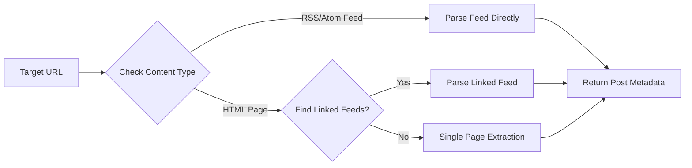
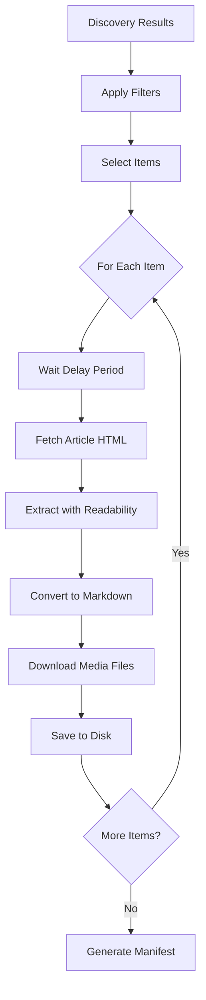

# UltraScrape: Targeted Web Article Archiver for Claude Code

<div align="center">
  
</div>


**The first respectful, targeted web article fetcher: Discover via RSS/HTML, download only what you need, converted to clean Markdown with local media. Stays polite, automatically.**

---

## ⚡ Quick Start

**Just installed? Try this prompt:**

> "Claude, use UltraScrape to discover articles from https://blog.example.com/feed.xml, then download the 5 most recent ones to ./my-articles"

**Common patterns:**

| What you want | Say this to Claude |
|---------------|-------------------|
| Discover available articles | "Use UltraScrape to discover articles from [URL]" |
| Download recent articles | "Download the 10 most recent articles from [URL] to [folder]" |
| Filter by topic | "Fetch articles about [topic] from [URL]" |
| Archive a blog | "Archive all articles from [URL] with 2 second delays" |
| Build a dataset | "Download 100 articles from [URL] without media to [folder]" |

---

## 🚀 What is UltraScrape?

UltraScrape is a Claude Code plugin that solves the "Bulk Scraping vs Targeted Retrieval" problem. Most web scrapers crawl everything indiscriminately, hammering servers and downloading content you don't need. UltraScrape takes a different approach.

It maintains a two-phase workflow:
1. **Discovery Engine**: Finds available articles via RSS feeds or HTML link discovery
2. **Download Engine**: Selectively fetches only the articles you filtered, with rate limiting and polite defaults

(Think of it as "window shopping before buying" - you browse the catalog first, then only download what matters. Your bandwidth and their servers both thank you.)

When you run a discovery, UltraScrape analyzes feeds or page structure, then lets you filter by date, tags, or custom criteria before downloading. Each downloaded article becomes clean Markdown (we call them Mike Dion files around here - .md = Mike Dion, get it?) with extracted metadata, original HTML backup, and locally-stored media files.

### Why Natural Language?

Traditional CLI tools make you memorize flags like `--filters '{"dateRange":{"start":"2024-01-01"}}'`. With UltraScrape and Claude Code, you just say "articles from 2024" and Claude translates that into the right commands.

| Old Way | New Way |
|---------|---------|
| `node scripts/download-engine.js https://blog.com/feed --filters '{"limit":10,"tags":["ai"]}'` | "Download 10 AI articles from https://blog.com/feed" |
| Look up documentation | "Claude, what can UltraScrape do?" |
| Debug command syntax | "That didn't work, can you fix it?" |

(No more Stack Overflow at 2 AM. You're welcome.)

### Key Features

- 🔍 **Smart Discovery**: Automatically detects RSS/Atom feeds, linked feeds, or falls back to single-page extraction
- 🎯 **Targeted Downloads**: Filter by date range, tags, or custom criteria before fetching
- ⏱️ **Respectful Rate Limiting**: Default 1 request/second with configurable delays
- 📝 **Clean Mike Dion Files**: Uses Mozilla Readability for article extraction, Turndown for Markdown conversion
- 📦 **Complete Archives**: Saves Markdown, metadata JSON, original HTML, and media files per article
- 🛡️ **Built-in Safeguards**: User agent identification, configurable limits, delay mechanisms
- 🔄 **Structured Output**: Domain-organized directories with manifest files for easy navigation
- 📊 **Progress Tracking**: Real-time console feedback during discovery and download phases

---

## 📦 Installation

### Quick Start

**Tell Claude Code:**

> "Hey Claude, install the UltraScrape plugin for me. Clone it to the plugins directory and run npm install."

Or manually:

```bash
cd ~/.claude-code/plugins
git clone https://github.com/justfinethanku/Ultra-Scrape.git ultrascrape-plugin
cd ultrascrape-plugin
npm install
```

### Verify Installation

**Ask Claude:**

> "Claude, test the UltraScrape plugin by discovering articles from https://example.com/feed.xml"

---

## 🚦 How It Works

UltraScrape uses a two-phase approach to ensure targeted, respectful web archiving:

### Phase 1: Discovery



The discovery engine:
1. Fetches the target URL
2. Detects if it's a feed, has linked feeds, or is a single page
3. Extracts article metadata (title, URL, date, description, tags)
4. Returns structured discovery data with up to 50 items (configurable)

### Phase 2: Download



The download engine:
1. Takes discovery results and applies your filters (date range, tags, limit)
2. Fetches each article HTML with configurable rate limiting
3. Uses Mozilla Readability to extract clean article content
4. Converts to Markdown via Turndown
5. Downloads images and media to local `media/` directory
6. Saves complete archive: `index.md`, `metadata.json`, `original.html`
7. Updates domain manifest (`index.json`) for tracking

---

## 🛠️ Usage

Just talk to Claude Code naturally! Here are example prompts you can use:

### Basic Discovery

**Copy-paste these prompts:**

> "Claude, use UltraScrape to discover what articles are available at https://blog.example.com/feed.xml"

> "Find all articles from https://techblog.com/rss and show me what's available"

> "Discover articles from https://news.site/feed but limit it to 100 items"

### Basic Download

> "Claude, download articles from https://blog.example.com/feed.xml to ./my-archive"

> "Use UltraScrape to fetch articles from https://myblog.com/rss and save them as Markdown"

### Advanced Filtering

> "Download only the 5 most recent articles from https://blog.example.com/feed.xml"

> "Fetch articles from https://blog.site/rss from 2024 only and save to ./2024-articles"

> "Download articles tagged with 'ai' or 'machine-learning' from https://techblog.com/feed"

> "Get the 10 most recent JavaScript articles from https://devblog.com/rss published after June 2024"

### Rate Limiting & Politeness

> "Download articles from https://blog.example.com/feed.xml but use a 2 second delay between requests to be extra polite"

> "Fetch articles from https://news.site/rss without downloading media files - text only"

> "Very politely download 5 articles from https://blog.com/feed with 3 second delays and no media"

### Combining Options

> "Claude, discover articles from https://devblog.com/feed, filter for articles about TypeScript from 2024, download only 10 of them with images to ./ts-articles, and use 2 second delays"

---

## 📊 Output Structure

Each downloaded article creates this structure:

```
output/
└── blog.example.com/
    ├── index.json                    # Manifest of all articles from this domain
    ├── article-title-slug/
    │   ├── index.md                  # Clean Markdown version
    │   ├── metadata.json             # Structured metadata (title, date, author, etc.)
    │   ├── original.html             # Raw HTML backup
    │   └── media/
    │       ├── image-001.jpg         # Downloaded images
    │       ├── image-002.png
    │       └── diagram.svg
    └── another-article/
        ├── index.md
        ├── metadata.json
        ├── original.html
        └── media/
```

### Markdown Output Format

Each `index.md` (Mike Dion file) includes frontmatter:

```markdown
---
title: "Article Title"
url: "https://blog.example.com/article"
date: "2024-01-15"
author: "Author Name"
tags: ["ai", "programming"]
description: "Article summary..."
---

# Article Title

Clean article content in Markdown...


```

---

## ⚙️ What Claude Code Will Do

When you give Claude a UltraScrape prompt, here's what happens behind the scenes:

1. **Claude translates your request** into the appropriate command-line flags
2. **Runs discovery** to find available articles
3. **Shows you what was found** (count, date range, topics)
4. **Applies your filters** (date, tags, limit)
5. **Downloads the articles** with proper rate limiting
6. **Converts to clean Markdown** with local media
7. **Reports the results** and where files were saved

### Available Options Claude Can Use

| What you ask for | Claude will use |
|------------------|-----------------|
| "Limit to 10 articles" | `--filters '{"limit":10}'` |
| "From 2024 only" | `--filters '{"dateRange":{"start":"2024-01-01"}}'` |
| "Articles about AI" | `--filters '{"tags":["ai"]}'` |
| "2 second delays" | `--delay 2000` |
| "No images" or "text only" | `--no-media` |
| "Save to ./my-folder" | `--output ./my-folder` |

### Filter Options Reference

You can combine multiple filters in your prompts:

```
Date range: "from January 2024", "published after June 1st", "from 2024 only"
Tags: "about JavaScript", "tagged with AI", "related to tutorials"
Limit: "only 5 articles", "up to 20 posts", "first 10 items"
Search: "containing the word 'async'", "with 'TypeScript' in the title"
```

---

## 🧪 Use Cases

### Research Paper Collection

**Prompt:**
> "Claude, collect the 20 most recent ML papers from https://arxiv.org/list/cs.AI/recent published in 2024 and save them to ./ml-research"

### Blog Archive for Offline Reading

**Prompt:**
> "Archive all tutorial and guide posts from https://myblog.com/feed.xml to ./tutorials. Be polite with 2 second delays."

### Content Analysis Dataset

**Prompt:**
> "Build a dataset from https://news.site/rss - download 100 articles without media files to ./news-corpus"

### Targeted Documentation Backup

**Prompt:**
> "Back up API and reference documentation from https://docs.example.com/feed to ./docs-backup"

### Personal Knowledge Base

**Prompt:**
> "I want to build a personal knowledge base. Discover articles from these feeds: https://paulgraham.com/rss.html, https://waitbutwhy.com/feed, and download articles about writing and thinking from the past year to ./knowledge-base"

---

## 🛡️ Respectful Scraping Guidelines

UltraScrape is designed with respectful web practices in mind:

### Built-in Protections

- **User Agent**: Identifies as `UltraScrape/0.1` with contact info
- **Rate Limiting**: Default 1 request/second (1000ms delay)
- **Request Caps**: Default limit of 20 downloads per run
- **Targeted Approach**: Discovery first, download second (no blind crawling)

### Your Responsibilities

1. **Check robots.txt**: Respect site crawling policies
2. **Review Terms of Service**: Ensure scraping is permitted
3. **Increase Delays**: Use `--delay 2000` or higher for busy sites
4. **Lower Limits**: Use `--filters '{"limit":5}'` for testing
5. **Provide Auth**: For private content, add cookies/headers (code modification required)
6. **Monitor Responses**: Watch for 429/403 errors and back off

### What UltraScrape Won't Do

- Bypass paywalls or authentication
- Render JavaScript-heavy SPAs (use direct article URLs or RSS feeds)
- Crawl entire domains (only fetches specified articles)
- Ignore rate limits or retry after blocks

---

## 🔧 Advanced Configuration

### Custom User Agent

**Ask Claude:**
> "Claude, update the UltraScrape user agent to identify as 'MyBot/1.0' with my contact email in both discovery and download engines"

### Custom Filters

**Ask Claude:**
> "Add a custom filter to UltraScrape that lets me filter articles by author name"

### Integration with Claude Code Slash Command

**Ask Claude:**
> "Create a slash command /ultrascrape that:
> 1. Discovers articles from a URL
> 2. Asks me for filtering preferences
> 3. Downloads the filtered articles
> 4. Reports what was saved and where"

This creates `.claude/commands/ultrascrape.md` that you can then invoke with:
```
/ultrascrape https://blog.example.com/feed.xml
```

---

## 🤝 Contributing

Contributions welcome! Areas for improvement:

- [ ] JavaScript rendering support (Puppeteer/Playwright integration)
- [ ] Additional output formats (JSON, HTML)
- [ ] robots.txt automatic checking
- [ ] Cookie/session authentication support
- [ ] Parallel downloads with concurrency control
- [ ] Progress bars and better logging
- [ ] Incremental updates (only fetch new articles)
- [ ] Content deduplication

### Development Setup

**Ask Claude:**
> "Clone the UltraScrape repo, install dependencies, and run the test suite to make sure everything works"

Or manually:
```bash
git clone https://github.com/justfinethanku/Ultra-Scrape.git
cd Ultra-Scrape
npm install
npm run discovery -- https://example.com/feed.xml  # Test discovery
npm run download -- https://example.com/feed.xml --filters '{"limit":2}' --output ./test  # Test download
```

---

## 📋 Roadmap

### v0.2.0 (Planned)
- JavaScript rendering via Puppeteer
- Automatic robots.txt checking
- Better error handling and retry logic

### v0.3.0 (Planned)
- Authentication support (cookies, headers)
- Parallel downloads with concurrency limits
- Incremental fetch mode (only new articles)

### v1.0.0 (Planned)
- Full Claude Code integration with slash command
- Interactive filtering UI
- Content deduplication
- Export to various formats (PDF, EPUB)

---

## 📄 License

MIT License - See LICENSE file for details

---

## 🙏 Credits

Built with:
- [axios](https://axios-http.com/) - HTTP client
- [cheerio](https://cheerio.js.org/) - HTML parsing
- [jsdom](https://github.com/jsdom/jsdom) - DOM implementation
- [@mozilla/readability](https://github.com/mozilla/readability) - Article extraction
- [turndown](https://github.com/mixmark-io/turndown) - HTML to Markdown conversion
- [fast-xml-parser](https://github.com/NaturalIntelligence/fast-xml-parser) - XML/RSS parsing

---

## 💬 Getting Help

**Talk to Claude:**
> "Claude, show me the UltraScrape documentation"
> "How do I filter articles by date with UltraScrape?"
> "What are all the options available in UltraScrape?"

---

**UltraScrape** - Because sometimes you just want the articles, not the entire internet.

Made for Claude Code. Just ask Claude naturally, no commands to memorize.
