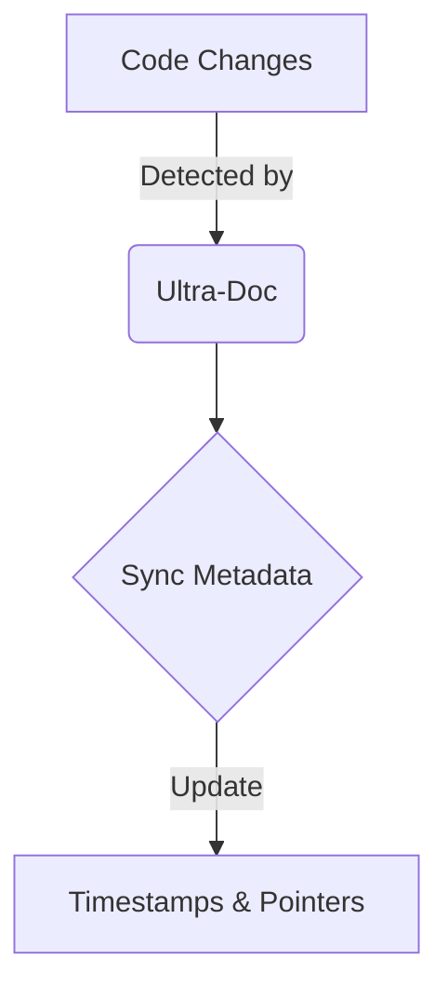

# [PROJECT_NAME]: {{ONE_LINE_TAGLINE}}

<!--
INSTRUCTIONS: Replace [PROJECT_NAME] with your project name and {{ONE_LINE_TAGLINE}} with a compelling one-liner.
Example: "Ultra-Doc 2.0: Dual-Track Documentation for Humans & AI"
-->

<div align="center">
  
</div>

<!--
INSTRUCTIONS: Add your hero/cover image at the top for visual impact.
- Use {{HERO_IMAGE_FILENAME}} like "my-project-hero.png" or "project-banner.jpg"
- Image should be full-width and showcase your project
- If you don't have a hero image, remove this section entirely
- Place the actual image file in your repository root
-->


<!--
INSTRUCTIONS: Update badge values:
- {{VERSION}}: Your current version (e.g., "2.0.0", "1.5.3")
- {{LICENSE}}: Your license type (e.g., "MIT", "Apache-2.0", "GPL-3.0")
- {{PLATFORM_NAME}}: What platform/ecosystem (e.g., "Claude_Code", "Node.js", "Python")
- {{PLATFORM_TYPE}}: Type descriptor (e.g., "Plugin", "Library", "CLI")
Add or remove badges as needed. Keep them consistent in style.
-->

**{{ELEVATOR_PITCH}}**

<!--
INSTRUCTIONS: Write your elevator pitch. Follow the formula:
"The first/only [unique characteristic]: [what it does for machines/users], [what it does for humans]. [How it stays working], [adverb describing how]."

Example: "The first 'Dual-Track' documentation system: Machine-perfect context for AI, human-readable narratives for you. Kept in sync, automatically."

Keep it under 200 characters. Make the value proposition crystal clear.
-->

---

## 🚀 What is [PROJECT_NAME]?

<!--
SECTION STRUCTURE: [What] + [Problem] + [Solution] + [Personality Moment]
This is your hero section. Hook the reader in 3-4 paragraphs max.
-->

[PROJECT_NAME] is a {{PROJECT_TYPE}} that solves the "{{PROBLEM_NAME}}" problem. {{DESCRIBE_THE_PROBLEM_IN_1_2_SENTENCES}}.

<!--
INSTRUCTIONS: Define the problem clearly and relatable.
Example: "It solves the 'Context Rot' problem. Your docs get stale, your AI gets confused, and your team wastes hours re-explaining the same architecture."
-->

{{HOW_IT_WORKS_OVERVIEW}}

<!--
INSTRUCTIONS: Explain your solution in simple terms. Use numbered lists if you have distinct components/tracks/modes.
Example:
"It maintains two synchronized sets of documentation:
1. **`context_for_llms/`**: Optimized, token-efficient, rigid Markdown for Claude.
2. **`context_for_humans/`**: Readable, narrative-driven docs for your team."
-->

({{PERSONALITY_MOMENT}})

<!--
INSTRUCTIONS: Add a light, humanizing aside. Examples:
- "(Yes, we call them 'Mike Dion' files. It's a thing. .md = Mike Dion. Get it? Moving on...)"
- "(No more digging through Stack Overflow at 2 AM. You're welcome.)"
- "(It's basically magic, but with fewer wands and more regexes.)"

This breaks tension and shows personality. Keep it brief and in parentheses.
-->

{{MECHANISM_EXPLANATION}}

<!--
INSTRUCTIONS: Explain the core mechanism in 1-2 sentences.
Example: "When you change code, Ultra-Doc detects it, updates the machine docs, and **automatically translates** those updates into human-friendly language."

Use **bold** for key action words.
-->

### Key Features

<!--
STRUCTURE: Emoji + **Capability**: User Benefit.
List 5-8 features. Each line follows this exact pattern.
Choose metaphorical emoji (not literal):
- 🔄 for cycles/sync
- 🛡️ for protection/safety
- 🕵️ for detection/investigation
- ⏱️ for time/speed
- 📉 for reduction/optimization
- 📝 for writing/generation
- 📊 for metrics/reporting
-->

- **🔄 {{FEATURE_1_NAME}}**: {{FEATURE_1_BENEFIT}}.
- **🛡️ {{FEATURE_2_NAME}}**: {{FEATURE_2_BENEFIT}}.
- **🕵️ {{FEATURE_3_NAME}}**: {{FEATURE_3_BENEFIT}}.
- **⏱️ {{FEATURE_4_NAME}}**: {{FEATURE_4_BENEFIT}}.
- **📉 {{FEATURE_5_NAME}}**: {{FEATURE_5_BENEFIT}}.
- **📝 {{FEATURE_6_NAME}}**: {{FEATURE_6_BENEFIT}}.
- **📊 {{FEATURE_7_NAME}}**: {{FEATURE_7_BENEFIT}}.

<!--
INSTRUCTIONS: Focus on USER BENEFITS, not technical implementation.
Bad: "Uses JSON overlays for optimization"
Good: "Token Optimization: Uses JSON overlays to reduce context usage by up to 90%"

Quantify when possible (percentages, time saved, etc.)
-->

---

## 📦 Installation

<!--
INSTRUCTIONS: Installation should come BEFORE Quick Start since users need to install first.
Provide clear copy-paste prompts for Claude Code users.
For plugins/tools with repositories, include the GitHub URL in the prompt.
-->

### Quick Setup

**Copy and paste this prompt to Claude Code:**

```
Hey Claude, install [PROJECT_NAME] from {{GITHUB_REPO_URL}} - clone it to {{TARGET_DIRECTORY}} and run {{INSTALL_COMMAND}}.
```

<!--
INSTRUCTIONS: Fill in the placeholders:
- {{GITHUB_REPO_URL}}: Your GitHub repository URL (e.g., "https://github.com/username/repo.git")
- {{TARGET_DIRECTORY}}: Where to install (e.g., "the plugins directory as 'my-plugin'", "~/tools/myproject")
- {{INSTALL_COMMAND}}: Installation command (e.g., "npm install", "pip install -e .", "make install")

Example: "Hey Claude, install UltraScrape from https://github.com/justfinethanku/Ultra-Scrape.git - clone it to the plugins directory as 'ultrascrape-plugin' and run npm install."
-->

Or install manually:

```bash
{{MANUAL_INSTALL_COMMANDS}}
```

<!--
INSTRUCTIONS: Provide the full manual installation commands. Example:
cd ~/.claude-code/plugins
git clone https://github.com/username/repo.git project-name
cd project-name
npm install
-->

### Verify Installation

**Ask Claude:**

```
Claude, test [PROJECT_NAME] by {{VERIFICATION_TASK}}.
```

<!--
INSTRUCTIONS: Provide a simple verification task. Examples:
- "discovering articles from https://example.com/feed.xml"
- "running the hello world example"
- "checking the version"
-->

---

## ⚡ Quick Start

<!--
INSTRUCTIONS: Quick Start comes AFTER Installation.
Provide copy-paste prompts that demonstrate the most common use case.
Show what users can do immediately after installing.
-->

**Just installed? Copy and paste this prompt:**

```
Claude, use [PROJECT_NAME] to {{QUICK_START_TASK}}.
```

<!--
INSTRUCTIONS: Fill in {{QUICK_START_TASK}} with a simple, achievable first task. Examples:
- "discover articles from https://blog.example.com/feed.xml, then download the 5 most recent ones to ./my-articles"
- "analyze the current codebase and generate documentation"
- "run a hello world example"
-->

**Common patterns:**

| What you want | Say this to Claude |
|---------------|-------------------|
| {{USE_CASE_1}} | "{{PROMPT_1}}" |
| {{USE_CASE_2}} | "{{PROMPT_2}}" |
| {{USE_CASE_3}} | "{{PROMPT_3}}" |
| {{USE_CASE_4}} | "{{PROMPT_4}}" |
| {{USE_CASE_5}} | "{{PROMPT_5}}" |

<!--
INSTRUCTIONS: Create 4-6 common patterns showing natural language prompts.
Each row should have:
- What you want: Brief description of the goal
- Say this to Claude: Actual copy-paste prompt with [URL], [folder], [topic] placeholders

Examples:
| Discover available articles | "Use UltraScrape to discover articles from [URL]" |
| Download recent articles | "Download the 10 most recent articles from [URL] to [folder]" |
| Filter by topic | "Fetch articles about [topic] from [URL]" |
-->

---

## 🛠️ How It Works

<!--
SECTION PURPOSE: Explain the mechanism/workflow
Use diagrams if the flow has 3+ steps
Include a philosophy/comparison table if your approach differs from alternatives
-->

[PROJECT_NAME] {{DESCRIBE_WORKFLOW_TRIGGER_AND_FLOW}}.

<!--
INSTRUCTIONS: Describe when/how your tool runs. Example:
"runs a self-healing pipeline every time you invoke it"
"monitors your codebase in real-time and triggers updates when files change"
"analyzes pull requests automatically via GitHub Actions"
-->

<<OPTIONAL_MERMAID_DIAGRAM>>

<!--
[OPTIONAL] Include a Mermaid diagram if you have a multi-step process.
Keep it simple: 5-10 nodes max. Use decision diamonds for branching.
Remove this section if your workflow is simple (1-2 steps).

Example:

-->

### The "{{PHILOSOPHY_NAME}}" Philosophy

<!--
[OPTIONAL] Include a philosophy/approach table if your tool takes a unique stance.
Use this to contrast your approach with alternatives.
Remove if not applicable.
-->

| Feature | {{APPROACH_A_NAME}} | {{APPROACH_B_NAME}} |
| :--- | :--- | :--- |
| **{{DIMENSION_1}}** | {{A_VALUE_1}} | {{B_VALUE_1}} |
| **{{DIMENSION_2}}** | {{A_VALUE_2}} | {{B_VALUE_2}} |
| **{{DIMENSION_3}}** | {{A_VALUE_3}} | {{B_VALUE_3}} |
| **{{DIMENSION_4}}** | {{A_VALUE_4}} | {{B_VALUE_4}} |

<!--
INSTRUCTIONS: Comparison tables work well for:
- Dual-mode systems (AI vs Human, Dev vs Prod, etc.)
- Philosophy contrasts (Traditional vs Your Approach)
- Format comparisons (Input vs Output)

Keep rows to 4-6 for readability.
Use **bold** for row labels.
Left-align with `:---`
-->

---

## 🚦 Usage

### The One Command

<!--
INSTRUCTIONS: If your tool has a primary command, feature it prominently.
If you have multiple commands, change this to "Core Commands" and list 2-4.
-->

Everything happens through the single {{COMMAND_TYPE}}:

```bash
{{PRIMARY_COMMAND}}
```

When invoked, [PROJECT_NAME]:
1.  **{{STEP_1_ACTION}}** {{STEP_1_DESCRIPTION}}.
2.  **{{STEP_2_ACTION}}** {{STEP_2_DESCRIPTION}}.
3.  **{{STEP_3_ACTION}}** {{STEP_3_DESCRIPTION}}.
4.  **{{STEP_4_ACTION}}** {{STEP_4_DESCRIPTION}}.

<!--
INSTRUCTIONS: Break down what happens when users run your main command.
Use **bold** for action verbs (Scans, Chooses, Executes, Reports, etc.)
Keep to 3-5 steps maximum.
-->

#### {{DECISION_TREE_OR_OPTIONS_HEADER}}

<!--
[OPTIONAL] Include a decision-tree table if your tool has modes/options.
Remove this subsection if you have a single, linear workflow.
-->

| Option | What Happens | {{TRIGGER_CONDITION_COLUMN_NAME}} |
| :--- | :--- | :--- |
| **{{OPTION_1_NAME}}** | {{OPTION_1_BEHAVIOR}} | {{OPTION_1_TRIGGER}} |
| **{{OPTION_2_NAME}}** | {{OPTION_2_BEHAVIOR}} | {{OPTION_2_TRIGGER}} |
| **{{OPTION_3_NAME}}** | {{OPTION_3_BEHAVIOR}} | {{OPTION_3_TRIGGER}} |
| **{{OPTION_4_NAME}}** | {{OPTION_4_BEHAVIOR}} | {{OPTION_4_TRIGGER}} |

{{DECISION_TREE_EXPLANATION}}

<!--
INSTRUCTIONS: Explain how users choose between options. Examples:
- "Set the ENV_VAR environment variable... otherwise [TOOL] will prompt for a choice."
- "Use flags: --mode=quick for fast runs, --mode=deep for full analysis"
- "Interactive menu appears if no flags are provided"
-->

## 🧪 Quality {{GUARDRAILS_OR_FEATURES_NAME}}

<!--
SECTION PURPOSE: Showcase quality/validation/testing features
Choose a header that matches your domain:
- "Quality Guardrails" (for documentation/linting tools)
- "Testing & Validation" (for dev tools)
- "Security Features" (for security tools)
- "Performance Optimization" (for performance tools)
-->

### {{QUALITY_FEATURE_1_NAME}}

{{QUALITY_FEATURE_1_DESCRIPTION}}

<!--
INSTRUCTIONS: Describe each quality mechanism in 2-3 sentences.
Explain WHAT it does and WHY it matters.
Example: "Scans every inline code span... and verifies the file actually exists. Missing files are flagged... so broken references get caught before they hit the repo."
-->

### {{QUALITY_FEATURE_2_NAME}}

{{QUALITY_FEATURE_2_DESCRIPTION}}

### {{QUALITY_FEATURE_3_NAME}}

{{QUALITY_FEATURE_3_DESCRIPTION}}

### Configuration

<!--
[OPTIONAL] Include if your tool has configuration files.
Remove if your tool works out-of-the-box with no config.
-->

[PROJECT_NAME] creates a `{{CONFIG_FILE_NAME}}` in your {{CONFIG_LOCATION}}. You can customize:
- `{{CONFIG_OPTION_1}}`: {{CONFIG_OPTION_1_PURPOSE}}.
- `{{CONFIG_OPTION_2}}`: {{CONFIG_OPTION_2_PURPOSE}}.

<!--
INSTRUCTIONS: List 2-5 key configuration options users will actually change.
Don't exhaustively list every config field—link to docs for that.
-->

---

## 🔁 Automated {{HOOKS_OR_INTEGRATIONS_NAME}}

<!--
[OPTIONAL] Include if your tool integrates with other systems (Git hooks, CI/CD, IDE events, etc.)
Remove this entire section if your tool runs standalone without automation hooks.
Choose appropriate header:
- "Automated Hooks" (for IDE/editor plugins)
- "CI/CD Integration" (for build tools)
- "GitHub Actions" (for GitHub-specific tools)
-->

[PROJECT_NAME] wires itself into {{INTEGRATION_PLATFORM}} via `{{INTEGRATION_CONFIG_FILE}}` so {{BENEFIT_OF_AUTOMATION}}.

<!--
INSTRUCTIONS: Explain the automation setup in one sentence.
Example: "so documentation stays healthy even when humans forget to run /ultra-doc"
-->

| Hook | Trigger | Command |
| --- | --- | --- |
| {{HOOK_1_NAME}} | {{HOOK_1_TRIGGER}} | `{{HOOK_1_COMMAND}}` |
| {{HOOK_2_NAME}} | {{HOOK_2_TRIGGER}} | `{{HOOK_2_COMMAND}}` |
| {{HOOK_3_NAME}} | {{HOOK_3_TRIGGER}} | `{{HOOK_3_COMMAND}}` |
| {{HOOK_4_NAME}} | {{HOOK_4_TRIGGER}} | `{{HOOK_4_COMMAND}}` |
| {{HOOK_5_NAME}} | {{HOOK_5_TRIGGER}} | `{{HOOK_5_COMMAND}}` |

<!--
INSTRUCTIONS: List hooks/integrations in a 3-column table.
Keep rows to 3-7 (enough to show value, not so many it's overwhelming).
Use backticks for commands.
-->

{{HOOK_TABLE_NOTE}}

<!--
[OPTIONAL] Add a note about keeping the table in sync with config files.
Example: "Update this table (and `hooks.json`) together whenever hook behavior changes."
-->

---

## 📊 {{METRICS_OR_PROOF_SECTION_NAME}}

<!--
[OPTIONAL] Include if you have quantifiable benefits (performance, cost, time savings, etc.)
Remove if your value is qualitative or hard to measure.
Choose appropriate header:
- "Token Economics" (for AI/LLM tools measuring token usage)
- "Performance Metrics" (for speed/optimization tools)
- "Cost Savings" (for cost-reduction tools)
- "Time Savings" (for productivity tools)
-->

[PROJECT_NAME] {{PAYOFF_STATEMENT}}.

<!--
INSTRUCTIONS: Write a confident one-liner about ROI.
Examples:
- "pays for itself in token savings"
- "reduces build time by 10x"
- "cuts debugging time in half"
-->

| {{METRIC_SCENARIO_COLUMN}} | {{BASELINE_COLUMN}} | [PROJECT_NAME] | Savings |
| :--- | :--- | :--- | :--- |
| **{{SCENARIO_1}}** | {{BASELINE_1}} | {{YOUR_TOOL_1}} | **{{SAVINGS_1}}** |
| **{{SCENARIO_2}}** | {{BASELINE_2}} | {{YOUR_TOOL_2}} | **{{SAVINGS_2}}** |
| **{{SCENARIO_3}}** | {{BASELINE_3}} | {{YOUR_TOOL_3}} | **{{SAVINGS_3}}** |

*{{METHODOLOGY_NOTE}}*

<!--
INSTRUCTIONS: Quantify your impact with a comparison table.
Structure: Scenario | Before | After | % Improvement
Use **bold** for scenario names and savings percentages.
Add methodology note in italics below table.
Example: "*Estimates based on a medium-sized repository (50-100 files).*"
Keep scenarios relevant to your users (3-4 rows max).
-->

---

## 🤝 Contributing

<!--
INSTRUCTIONS: Keep this simple. Don't link to complex CONTRIBUTING.md files.
3-4 steps max. Make it approachable.
-->

{{CONTRIBUTION_CTA}}

<!--
INSTRUCTIONS: Write a friendly call-to-action.
Examples:
- "Found a bug? Want a feature?"
- "We love contributions!"
- "Help make [PROJECT_NAME] better!"
-->

1.  {{CONTRIBUTION_STEP_1}}.
2.  {{CONTRIBUTION_STEP_2}}.
3.  {{CONTRIBUTION_STEP_3}}.

<!--
INSTRUCTIONS: Keep steps actionable and simple.
Examples:
- "Fork the repo"
- "Run /ultra-doc to validate your changes"
- "Submit a PR"
- "Open an issue with details"
- "Join our Discord to discuss"
-->

---

<<OPTIONAL_FOOTER>>

<!--
[OPTIONAL] Add a centered footer with branding, credits, or emotional connection.
Remove if you prefer a minimal ending.

Example:
<div align="center">
  <sub>Built with ❤️ for the Claude Code ecosystem.</sub>
</div>

Or:
<div align="center">
  <sub>Made by developers, for developers.</sub>
</div>
-->
