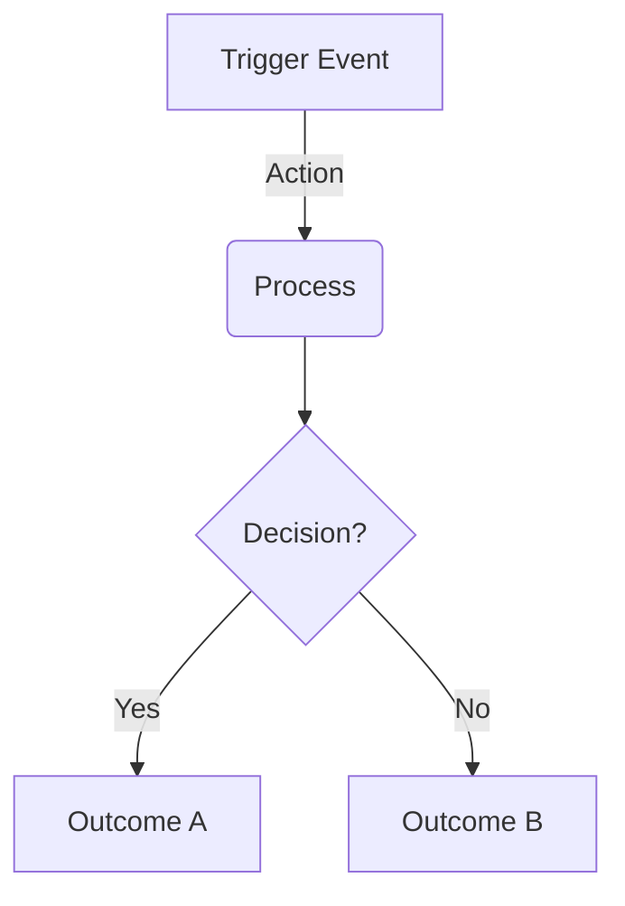

# README Template Usage Guide

This guide will help you transform the `README-TEMPLATE.md` into a compelling README for your project.

---

## Table of Contents

1. [Understanding Placeholder Types](#understanding-placeholder-types)
2. [Section-by-Section Guide](#section-by-section-guide)
3. [Tone & Voice Guidelines](#tone--voice-guidelines)
4. [Optional Sections Decision Tree](#optional-sections-decision-tree)
5. [Project Type Customizations](#project-type-customizations)
6. [Good vs Bad Examples](#good-vs-bad-examples)
7. [Final Checklist](#final-checklist)

---

## Understanding Placeholder Types

The template uses three types of placeholders:

### 1. `[BRACKETS]` - Simple Replacements
Replace with your project name exactly as-is.
- `[PROJECT_NAME]` → Your project name
- Example: `[PROJECT_NAME]` → `Ultra-Doc`

### 2. `{{DOUBLE_BRACES}}` - Content to Write
Replace with your own content following the guidance.
- `{{DESCRIPTION}}` → Your written description
- Example: `{{ONE_LINE_TAGLINE}}` → `Dual-Track Documentation for Humans & AI`

### 3. `<<ANGLE_BRACKETS>>` - Optional Sections
Entire sections that may or may not apply to your project.
- `<<OPTIONAL_MERMAID_DIAGRAM>>` → Include diagram or remove section entirely
- Example: If your workflow is simple, delete the entire mermaid diagram block

---

## Section-by-Section Guide

### Hero Section (Top)

**What it is:** The first thing users see. Your elevator pitch.

**How to fill it out:**

1. **Project Name + Tagline**
   ```markdown
   # [PROJECT_NAME]: {{ONE_LINE_TAGLINE}}
   ```
   - Keep tagline under 80 characters
   - Format: "[Unique characteristic]: [what it does]"
   - Example: `DocuMate: Automated API Documentation That Actually Stays Updated`

2. **Hero Image** (Optional but Recommended)
   - If you have a hero image: Replace `{{HERO_IMAGE_FILENAME}}` with your image filename
   - Place image file in repository root
   - If you don't have one: Delete the entire `<div align="center">` block
   - Recommended size: 1200x600px minimum
   - File formats: PNG, JPG, or WebP
   - Example: `ultra-scrape-repo.png`, `my-project-hero.jpg`

3. **Badges**
   - Version: Your current release (e.g., `1.0.0`, `2.5.3`)
   - License: Choose from MIT, Apache-2.0, GPL-3.0, etc.
   - Platform: What ecosystem? (Node.js, Python, Claude Code, VS Code, etc.)
   - Add more badges if needed: Build status, downloads, etc.

4. **Elevator Pitch**
   ```markdown
   **{{ELEVATOR_PITCH}}**
   ```
   - Formula: "The first/only [unique thing]: [benefit 1], [benefit 2]. [How it works], [adverb]."
   - Under 200 characters
   - Example: `The only linter that fixes itself: Catches errors automatically, explains them clearly. Runs on every save, invisibly.`

### What is [PROJECT_NAME]? Section

**What it is:** Your hero section. Hook the reader.

**Structure:** Problem → Solution → Personality → Mechanism

**How to fill it out:**

1. **Problem Statement**
   ```markdown
   [PROJECT_NAME] is a {{PROJECT_TYPE}} that solves the "{{PROBLEM_NAME}}" problem.
   ```
   - Name the problem in quotes (makes it memorable)
   - Examples: "Context Rot", "Config Hell", "Dependency Chaos"
   - Describe the problem in 1-2 relatable sentences

2. **Solution Overview**
   - Use numbered lists if you have distinct components
   - Use bold for important terms: `**context_for_llms/**`
   - Keep it high-level (details come later)

3. **Personality Moment**
   ```markdown
   ({{PERSONALITY_MOMENT}})
   ```
   - Light, humanizing aside in parentheses
   - Examples:
     - `(Yes, we named it after the coffee. Deal with it.)`
     - `(It's like having a junior dev who never sleeps and never complains.)`
     - `(No more 3 AM config debugging. You're welcome.)`
   - Keep it brief (under 100 characters)

4. **Mechanism Explanation**
   - 1-2 sentences explaining HOW it works
   - Use **bold** for key action words
   - Example: `When you push code, AutoDoc **detects** changes, **generates** new docs, and **opens** a PR automatically.`

### Key Features

**What it is:** Bullet-point value propositions.

**Formula:** `- **[Emoji] [Capability Name]**: [User Benefit].`

**Emoji Selection Guide:**

Choose metaphorical emoji (not literal):
- 🔄 Cycles, sync, continuous processes
- 🛡️ Protection, safety, validation
- 🕵️ Detection, investigation, analysis
- ⏱️ Time savings, speed, performance
- 📉 Reduction, optimization, efficiency
- 📝 Generation, writing, creation
- 📊 Metrics, reporting, visibility
- 🚀 Launch, deployment, shipping
- 🧪 Testing, experimentation, quality
- 🤖 Automation, AI, intelligence

**How to write features:**

Bad:
```markdown
- **Uses JSON for storage**: Stores data in JSON format.
```
(Too technical, repeats itself, no user benefit)

Good:
```markdown
- **📉 Zero-Config Setup**: Works out of the box with sensible defaults—no YAML wrestling required.
```
(Benefit-focused, quantified, personality)

**Tips:**
- Include numbers when possible: "90% faster", "zero configuration", "10x reduction"
- Focus on outcomes, not implementation
- Keep each feature to one line
- List 5-8 features (more feels overwhelming, fewer feels incomplete)

### Installation

**What it is:** Copy-paste friendly installation instructions for Claude Code users.

**IMPORTANT:** Installation must come BEFORE Quick Start section since users need to install before they can use.

**How to structure:**

1. **Quick Setup (Primary Method):**
   - Use a code block (not blockquote) for easy copy-paste
   - Include the full GitHub repository URL in the prompt
   - Specify where to clone and what command to run
   - Template format:
     ```
     Hey Claude, install [PROJECT_NAME] from {{GITHUB_REPO_URL}} - clone it to {{TARGET_DIRECTORY}} and run {{INSTALL_COMMAND}}.
     ```
   - Example:
     ```
     Hey Claude, install UltraScrape from https://github.com/justfinethanku/Ultra-Scrape.git - clone it to the plugins directory as 'ultrascrape-plugin' and run npm install.
     ```

2. **Manual Installation (Fallback):**
   - Provide full bash commands for users who prefer manual setup
   - Include all steps: cd, git clone, install dependencies
   - Example:
     ```bash
     cd ~/.claude-code/plugins
     git clone https://github.com/username/repo.git project-name
     cd project-name
     npm install
     ```

3. **Verify Installation:**
   - Give users a simple test prompt to confirm it works
   - Use a code block for copy-paste
   - Example:
     ```
     Claude, test [PROJECT_NAME] by {{VERIFICATION_TASK}}.
     ```

**Key Improvements:**
- ✅ Code blocks instead of blockquotes (easier to copy)
- ✅ GitHub URL included directly in prompt (Claude needs this)
- ✅ Clear target directory specification
- ✅ Verification step to confirm success

### Quick Start

**What it is:** Immediate demonstration of what users can do after installing.

**IMPORTANT:** Quick Start comes AFTER Installation (users need to install first).

**How to structure:**

1. **First Prompt:**
   - Give users a single, complete prompt they can copy-paste immediately
   - Use a code block (not blockquote) for easy copying
   - Template:
     ```
     Claude, use [PROJECT_NAME] to {{QUICK_START_TASK}}.
     ```
   - Example:
     ```
     Claude, use UltraScrape to discover articles from https://blog.example.com/feed.xml, then download the 5 most recent ones to ./my-articles
     ```

2. **Common Patterns Table:**
   - Create a 2-column table: "What you want" | "Say this to Claude"
   - Include 4-6 common use cases
   - Use placeholders like [URL], [folder], [topic] in prompts
   - Make prompts natural and conversational
   - Example:
     | What you want | Say this to Claude |
     |---------------|-------------------|
     | Discover available articles | "Use UltraScrape to discover articles from [URL]" |
     | Download recent articles | "Download the 10 most recent articles from [URL] to [folder]" |

**Why this matters:**
- Shows immediate value
- Teaches users the natural language interface
- Provides copy-paste examples for common tasks
- Reduces time to first success

### How It Works

**What it is:** Explain your mechanism/workflow.

**When to include a Mermaid diagram:**
- Your process has 3+ steps
- There are decision points (if/then branching)
- Visual flow adds clarity

**When to skip the diagram:**
- Simple linear workflow (1-2 steps)
- Complexity doesn't justify the space

**How to write the diagram:**


Keep it to 5-10 nodes maximum.

**Philosophy/Comparison Table:**

Use this when:
- You have dual modes (AI vs Human, Dev vs Prod)
- Your approach differs from traditional methods
- You need to contrast two paradigms

Structure:
```markdown
| Feature | Approach A | Approach B |
| :--- | :--- | :--- |
| **Dimension 1** | Value A1 | Value B1 |
| **Dimension 2** | Value A2 | Value B2 |
```

Keep to 4-6 rows for readability.

### Usage

**What it is:** How users actually use your tool.

**The One Command:**
- If you have a primary command, feature it prominently
- Break down what happens in 3-5 numbered steps
- Use **bold** for action verbs (Scans, Analyzes, Generates, etc.)

**Decision Tree Table:**

Use when:
- Your tool has multiple modes/options
- Users need to choose between workflows
- Different triggers cause different behaviors

Structure:
```markdown
| Option | What Happens | Trigger Condition |
| :--- | :--- | :--- |
| **Mode 1** | Behavior description | When/how it triggers |
```

After the table, explain how users choose between options:
- Environment variables
- CLI flags
- Interactive prompts
- Auto-detection logic

### Quality Guardrails

**What it is:** Showcase validation/testing/quality features.

**Choose the right header for your domain:**
- Documentation tools → "Quality Guardrails"
- Dev tools → "Testing & Validation"
- Security tools → "Security Features"
- Performance tools → "Performance Optimization"

**How to write feature descriptions:**
- 2-3 sentences each
- Explain WHAT it does and WHY it matters
- Focus on user impact
- Example: "Scans every import statement and verifies the module exists. Catches typos before they hit production."

**Configuration subsection:**
- Only include if you have a config file users will customize
- List 2-5 key options (not exhaustive)
- Format: `option_name`: Purpose/impact
- Remove if your tool works out-of-the-box with zero config

### Automated Hooks/Integrations

**When to include this section:**
- Your tool integrates with Git hooks
- You have CI/CD integration
- You hook into IDE/editor events
- You work with GitHub Actions or similar

**When to skip:**
- Your tool is standalone
- No automation capabilities

**How to structure:**

1. Explain the integration in one sentence:
   ```markdown
   [PROJECT_NAME] wires itself into {{PLATFORM}} via {{CONFIG}} so {{BENEFIT}}.
   ```

2. Hook table:
   ```markdown
   | Hook | Trigger | Command |
   | --- | --- | --- |
   | PreCommit | Before git commit | `mytool validate` |
   ```

3. List 3-7 hooks (enough to show value, not overwhelming)

4. Add sync note if applicable:
   ```markdown
   Update this table (and `hooks.json`) together whenever hook behavior changes.
   ```

### Metrics/Proof Section

**When to include:**
- You have quantifiable benefits (time, cost, performance)
- You can compare before/after metrics
- You have ROI data

**When to skip:**
- Benefits are qualitative
- Hard to measure impact
- Early-stage project without data

**Choose the right header:**
- AI/LLM tools → "Token Economics"
- Performance tools → "Performance Metrics"
- Cost tools → "Cost Savings"
- Productivity tools → "Time Savings"

**How to structure:**

1. **Payoff statement:**
   ```markdown
   [PROJECT_NAME] pays for itself in token savings.
   ```
   Be confident. You have data.

2. **Comparison table:**
   ```markdown
   | Scenario | Before | After | Savings |
   | :--- | :--- | :--- | :--- |
   | **Real Use Case** | Baseline metric | Your tool metric | **XX%** |
   ```

3. **Tips:**
   - Use **bold** for scenario names and savings percentages
   - Include units (tokens, seconds, dollars)
   - Keep to 3-4 scenarios
   - Add methodology note in italics below:
     ```markdown
     *Estimates based on [explain dataset/conditions].*
     ```

### Contributing

**Keep it simple:** 3-4 steps maximum.

**Structure:**
1. Friendly CTA
2. Actionable steps
3. No complex CONTRIBUTING.md links (this is the quick version)

**Examples:**

```markdown
Found a bug? Want a feature?
1. Fork the repo.
2. Run tests to validate your changes.
3. Submit a PR.
```

```markdown
We love contributions!
1. Open an issue to discuss your idea.
2. Make your changes in a feature branch.
3. Submit a PR with tests.
```

### Footer

**Optional.** Use for branding or emotional connection.

**Examples:**

```markdown
<div align="center">
  <sub>Built with ❤️ for the Claude Code ecosystem.</sub>
</div>
```

```markdown
<div align="center">
  <sub>Made by developers, for developers.</sub>
</div>
```

Remove if you prefer a minimal ending.

---

## Tone & Voice Guidelines

### Voice Characteristics

Based on the Ultra-Doc analysis, the winning formula is:

1. **Conversational but Professional**
   - Use contractions: "it's", "you're", "we'll"
   - Address the reader: "you", "your team"
   - But avoid being too casual: No "LOL", "totally", "super awesome"

2. **Confidence Without Arrogance**
   - Good: "solves the problem", "pays for itself"
   - Bad: "the best", "revolutionary", "game-changing"
   - Let the value speak for itself

3. **Benefit-Focused, Not Feature-Focused**
   - Bad: "Uses advanced ML algorithms"
   - Good: "Catches bugs 10x faster using ML pattern recognition"
   - Always answer: "So what? What's in it for me?"

4. **Evidence-Based**
   - Quantify when possible: "92% savings", "10x faster", "zero config"
   - Use real scenarios, not hypotheticals
   - Back claims with data

5. **Humor in Moderation**
   - One personality moment per major section maximum
   - Use parenthetical asides: (It's a thing...)
   - Keep it brief and relevant
   - When in doubt, remove it

### Sentence Patterns to Use

**Action-oriented:**
- "Copy and paste this prompt..."
- "Run this command to..."
- "Start by..."

**Value propositions:**
- "[Tool] solves [problem] by [mechanism]"
- "Never [pain point] again"
- "Automatically [desired outcome]"

**Confidence builders:**
- "Here's how it works:"
- "When you run [command], [tool]:"
- "Set it and forget it."

### Words to Avoid

- "Might", "perhaps", "maybe" (sounds uncertain)
- "Revolutionary", "game-changing", "paradigm shift" (sounds like marketing fluff)
- "Easy", "simple", "just" (dismissive, often untrue)
- "Leverage", "utilize" (use "use" instead)
- "Solutions", "ecosystem", "framework" (overused jargon)

### Words to Use

- "Automatically", "detects", "generates" (action verbs)
- "Solves", "fixes", "catches" (problem-solving)
- "Never", "always", "every" (absolutes backed by facts)
- "You", "your", "team" (direct address)
- Numbers: "90%", "10x", "zero" (quantifiable)

---

## Optional Sections Decision Tree

Use this flowchart to decide what to include:

### Cover Image?
- **Include if:** You have a professional cover image ready
- **Skip if:** You don't have design resources, or your tool is CLI-only

### Mermaid Diagram?
- **Include if:** Workflow has 3+ steps OR has decision branching
- **Skip if:** Workflow is linear and simple (1-2 steps)

### Philosophy/Comparison Table?
- **Include if:** Your approach differs significantly from alternatives OR you have dual modes
- **Skip if:** You're using standard patterns/approaches

### Decision Tree Table (in Usage)?
- **Include if:** Your tool has multiple modes/options users choose between
- **Skip if:** Single command, single workflow

### Quality Guardrails Section?
- **Include if:** You have validation, testing, or quality features to showcase
- **Skip if:** You're early-stage without quality tooling

### Configuration Subsection?
- **Include if:** You have a config file users will customize
- **Skip if:** Zero-config, everything is auto-detected

### Automated Hooks Section?
- **Include if:** You integrate with Git, CI/CD, IDE events, etc.
- **Skip if:** Standalone tool, no automation integrations

### Metrics/Proof Section?
- **Include if:** You have quantifiable performance/cost/time data
- **Skip if:** Benefits are qualitative or you lack metrics

### Footer?
- **Include if:** You want branding or emotional connection
- **Skip if:** You prefer minimal, professional ending

---

## Project Type Customizations

### CLI Tools

**Emphasize:**
- Installation methods (npm, pip, cargo, homebrew)
- Primary command(s)
- Flag/option reference (decision tree table)
- Example outputs (code blocks with actual output)

**De-emphasize:**
- UI/visual elements
- Cover images (unless you have cool ASCII art)

**Tone:** Direct, command-focused, efficiency-oriented

**Example adjustments:**
- Change "🚀 What is X?" to "🔧 What is X?"
- Focus Installation on package managers
- Usage section shows command examples with flags
- Remove or minimize philosophy tables

### Libraries/SDKs

**Emphasize:**
- Package manager installation
- Quick start code example (in Usage)
- API surface (what functions/classes are exposed)
- Integration examples

**De-emphasize:**
- Automated hooks (unless you have build-time hooks)
- Standalone command usage

**Tone:** Developer-focused, integration-oriented

**Example adjustments:**
- Add "Quick Start" subsection with code example after Installation
- Usage becomes "API Overview" with code snippets
- Metrics focus on "Performance" (latency, throughput)
- Contributing emphasizes testing and API stability

### Web Apps/Services

**Emphasize:**
- Live demo link or screenshots
- Sign-up/getting-started flow
- Feature showcase (what can you DO with it)
- Use cases/scenarios

**De-emphasize:**
- Installation (becomes "Getting Started" with sign-up link)
- Command-line usage

**Tone:** User-focused, outcome-oriented, visual

**Example adjustments:**
- Cover image is mandatory (screenshot or hero)
- Installation becomes "Get Started" with sign-up CTA
- Usage becomes "Key Features" with screenshots
- Add "Use Cases" section with scenarios
- Metrics focus on user outcomes (time saved, conversions, etc.)

### Plugins/Extensions

**Emphasize:**
- Platform compatibility (VS Code, Claude Code, browser, etc.)
- Marketplace installation
- Activation/setup within platform
- Platform-specific hooks/integrations

**De-emphasize:**
- Standalone usage (it's platform-dependent)

**Tone:** Integration-focused, platform-aware

**Example adjustments:**
- Badges include platform version compatibility
- Installation uses marketplace install prompts
- "How It Works" explains integration with platform
- Automated Hooks section is mandatory (show platform events)
- Contributing includes platform API testing

---

## Good vs Bad Examples

### Hero Section

**Bad:**
```markdown
## What is MyTool?

MyTool is a tool that helps you manage your projects better. It has many features that make project management easier and more efficient.
```
Why it's bad: Vague, no specific problem, no mechanism, reads like generic marketing

**Good:**
```markdown
## 🚀 What is MyTool?

MyTool is a project tracker that solves the "Context Switching" problem. Your team wastes 2+ hours daily jumping between Jira, Slack, and GitHub to understand project status.

MyTool aggregates updates from all three into a single dashboard, automatically.

(No more tab chaos. You're welcome.)

When you connect your tools, MyTool pulls real-time data, correlates related items, and highlights blockers before standup.
```
Why it's good: Specific problem (named), quantified pain (2+ hours), clear mechanism, personality moment, benefit-focused

### Feature List

**Bad:**
```markdown
- **Advanced Technology**: Uses cutting-edge AI algorithms.
- **User-Friendly**: Easy to use interface.
- **Scalable**: Can handle large amounts of data.
```
Why it's bad: Generic, no specifics, no user benefits, jargon-heavy

**Good:**
```markdown
- **🤖 AI-Powered Categorization**: Sorts 10,000+ items in seconds using pattern recognition trained on your workflow.
- **📱 Mobile-First Design**: Full feature parity on mobile—triage your inbox from anywhere.
- **📈 Auto-Scaling**: Handles 1M+ records without config changes or performance degradation.
```
Why it's good: Specific capabilities, quantified, user benefits clear, icons add visual interest

### Installation

**Bad:**
```bash
npm install mytool
```
Why it's bad: No context, assumes user knows npm, no explanation

**Good:**
```markdown
### 1. Install via npm (Node.js Projects)

For JavaScript/TypeScript projects using Node.js:

```text
Hey Claude, please install MyTool in this project:
npm install --save-dev mytool
```

```bash
npm install --save-dev mytool
```

This adds MyTool to your dev dependencies and creates a `.mytool.config.js` in your project root.
```
Why it's good: Scenario context, conversational prompt, explains outcome, copy-paste ready

### Metrics Table

**Bad:**
```markdown
| Feature | Speed |
| --- | --- |
| Search | Fast |
| Index | Very Fast |
```
Why it's bad: Qualitative (meaningless), no baseline comparison, no units

**Good:**
```markdown
| Query Type | PostgreSQL | MyTool | Speedup |
| :--- | :--- | :--- | :--- |
| **Full-Text Search** | 450ms | 12ms | **37x** |
| **Faceted Filters** | 1,200ms | 45ms | **26x** |
| **Aggregations** | 3,100ms | 89ms | **34x** |

*Benchmarked on 10M records (AWS r5.xlarge, 100 concurrent users).*
```
Why it's good: Specific scenarios, baseline comparison, quantified, methodology note, units included

---

## Final Checklist

Before publishing your README, verify:

### Content Completeness
- [ ] All `[BRACKETS]` replaced with project name
- [ ] All `{{DOUBLE_BRACES}}` replaced with written content
- [ ] All `<<ANGLE_BRACKETS>>` sections either filled or removed
- [ ] All HTML comments (`<!-- INSTRUCTIONS: ... -->`) removed
- [ ] Badge values updated (version, license, platform)

### Structure & Flow
- [ ] Hero section answers: What is it? What problem? How does it work?
- [ ] Features are benefit-focused (not feature-focused)
- [ ] Installation has clear paths for different scenarios
- [ ] Usage section shows the primary command/workflow
- [ ] Optional sections included only if applicable

### Tone & Voice
- [ ] Conversational but professional (no jargon, no fluff)
- [ ] Confident without being arrogant (evidence-based claims)
- [ ] Action-oriented language (commands, prompts are copy-paste ready)
- [ ] One personality moment max per major section
- [ ] Quantified benefits where possible (percentages, time, cost)

### Technical Accuracy
- [ ] Code examples are valid and tested
- [ ] Commands actually work
- [ ] Links point to correct URLs
- [ ] Version numbers are current
- [ ] Methodology notes explain data sources

### Visual Polish
- [ ] Cover image (if included) looks professional
- [ ] Mermaid diagrams (if included) are readable and accurate
- [ ] Tables are formatted consistently (left-aligned with `:---`)
- [ ] Code blocks have language tags for syntax highlighting
- [ ] Emoji usage is consistent and metaphorical (not literal)

### User Experience
- [ ] Copy-paste prompts include full context for AI assistants
- [ ] Installation paths cover common scenarios
- [ ] Decision trees help users choose the right option
- [ ] Contributing section is simple and approachable
- [ ] No broken links or references

### Platform-Specific (check if applicable)
- [ ] **CLI tools**: Flag reference and example outputs included
- [ ] **Libraries**: Quick start code example in Usage
- [ ] **Web apps**: Screenshots or demo link included
- [ ] **Plugins**: Platform compatibility and marketplace links clear

---

## Tips for Success

### Start with the Hero
Write the "What is [PROJECT_NAME]?" section first. Everything else flows from a clear problem/solution statement.

### Use Real Scenarios
When writing examples, use actual use cases from your users. "Explain Auth" is better than "Feature A".

### Iterate on Features
Your first feature list will be too technical. Rewrite each one focusing on user benefit. Ask: "So what?"

### Test with Fresh Eyes
Have someone unfamiliar with your project read the README. If they can't explain what it does in 30 seconds, rewrite the hero section.

### Keep It Updated
When you ship new features, update the README the same day. Stale READMEs kill trust.

### Quantify Everything Possible
Numbers are compelling. "Faster" means nothing. "10x faster" is concrete.

### Remove, Don't Add
Your first draft will be too long. Cut 30% before publishing. Every section should earn its place.

### Make It Scannable
Users skim. Use **bold** for key terms, tables for comparisons, bullets for lists. Dense paragraphs get skipped.

---

## Getting Help

If you get stuck:

1. **Re-read the original Ultra-Doc README** to see the patterns in action
2. **Look at popular READMEs in your domain** (but don't copy—understand the patterns)
3. **Test sections with AI**: Ask Claude "Is this clear?" and paste draft sections
4. **Ship and iterate**: A good README published is better than a perfect README in drafts

---

Good luck! Remember: The goal is to make someone excited about your project in under 2 minutes of reading.
